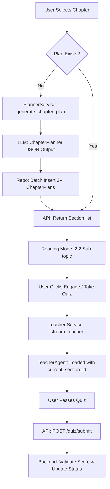

# Technical Implementation Plan: Mastery-Based JIT Tutor

## 1. System Architecture Overview (JIT Flow)



---

## 2. Database Schema Updates

### ChapterPlan (Existing Refinement)
*   `id`: UUID (Primary Key)
*   `title`: String (Sub-topic Title)
*   `chapter_id`: UUID (FK to Chapters)
*   `order_index`: Integer (Section 1, 2, 3...)
*   `content`: Text (The instructional prose)
*   `is_completed`: Boolean (Read progress - tracks per sub-topic)

### User Profile (Simple)
*   Utilize existing `User` model: `id`, `name`, `email`.
*   No new fields required for MVP as per 'Simple Profile' requirement.

### QuizQuestion (New Usage)
*   `chapter_id`: UUID (FK to Chapters)
*   `question_text`: Text
*   `options`: JSONB (List of strings)
*   `correct_answer`: String (The right option identifier)
*   `explanation`: Text (Feedback for incorrect answers)

---

## 3. LLM Prompt Specifications

### JIT ChapterPlanner (JSON Enforced)
**Constraint**: Must output ONLY a JSON object with 3-4 sections.
```json
{
  "sections": [
    {
      "title": "Section Title",
      "content": "Detailed 500-800 word instructional prose..."
    }
  ]
}
```

### TeacherAgent (Accuracy Locked)
**Context Window**: Initialized with `SYSTEM_PROMPT` + `CURRENT_SECTION_CONTENT`.
**Rule**: "You are a mentor for topic [SECTION_TITLE]. Do not discuss future topics in the curriculum. Your goal is to guide the user towards understanding [SECTION_CONTENT] and trigger the Quiz tool only when mastery is demonstrated."

---

## 4. API Specification

### GET `/api/v1/chapters/{id}/document` 
*   **Logic**: Fetches `ChapterPlans` for the ID. If count == 0, trigger `PlannerService.generate_chapter_plan` synchronously.
*   **Response**: `List[ChapterPlanSchema]` (Sorted by `order_index`).

### PATCH `/api/v1/chapters/sections/{section_id}/read`
*   **Logic**: Updates `ChapterPlan.is_completed = true` for the sub-topic.
*   **Frontend**: Triggered when user reaches the end of a section in Reading Mode.

### POST `/api/v1/quiz/{id}/submit` 
*   **Payload**: `{"answers": [{"q_id": UUID, "choice": "A"}]}`
*   **Security**: Server-side comparison against `QuizQuestion.correct_answer`. 
*   **Action**: If score >= 80%, update `Chapter.status` to `DONE` and `Topic.progress` percentage.

### GET `/api/v1/auth/me`
*   **Purpose**: Simple identity retrieval. Returns `name` and `email` for the dashboard profile badge.

---

## 5. Execution Roadmap

### Phase 1: Planning Refactor
*   Modify `PlannerService` to support JIT logic.
*   Update `ChapterPlanner` prompt for JSON structure.

### Phase 2: Secure Quiz Backend
*   Implement `QuizRepository` for question storage and answer validation.
*   Develop the `/submit` endpoint.

### Phase 3: Teacher Agent Refinement
*   Update `TeacherAgent` to focus on the `current_section_id` passed from the frontend.

### Phase 4: UI/Frontend Integration
*   Update Dashboard/Sidebar to reflect sectional progress based on the new JIT model.
